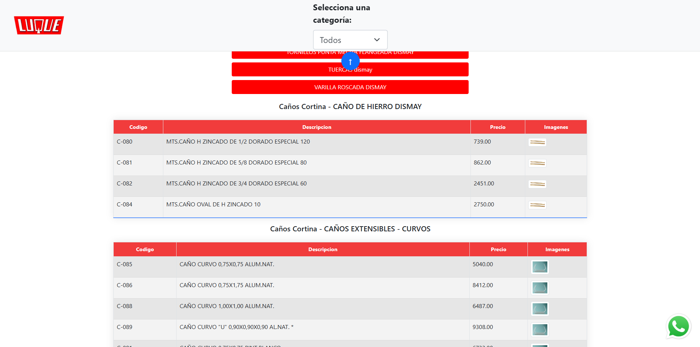

# Precios Luque

Una web para que los clientes puedan **ver precios de forma personalizada**.

---



---
## Características

- Podes elegir entre **dos tipos de precios**: mayorista o minorista.  
- Podes seleccionar las **categorías de productos** que podrán visualizar.  
- Los **precios se actualizan automáticamente** al subir un archivo nuevo.  

---

## Instalación

1. Clonar el repositorio:
```bash
git clone https://github.com/tu-usuario/precios-luque.git
cd precios-luque
```

2. Levantar la aplicación con Docker Compose:
```bash
docker-compose up -d
```

---

## Configuración de credenciales de Google Gmail

1. Obtener una **credencial OAuth de Google Gmail**.  
2. Renombrarla a `credentials.json`.  
3. Copiar el archivo en:
```
precios-luque/utils/credentials.json
```
4. Ejecutar el script de inicialización:
```bash
python3 precios-luque/utils/gmail.py
```
5. Luego de generar el token, **borrar el archivo `credentials.json`**.  
6. Asegurarse de que `token.json` permanezca en el directorio `precios-luque/utils/`.

---

## Notas

- `token.json` es necesario para que la aplicación funcione correctamente y **no debe ser eliminado**.  

---